# Sh4dow's IoT Simulator (SIoTs)

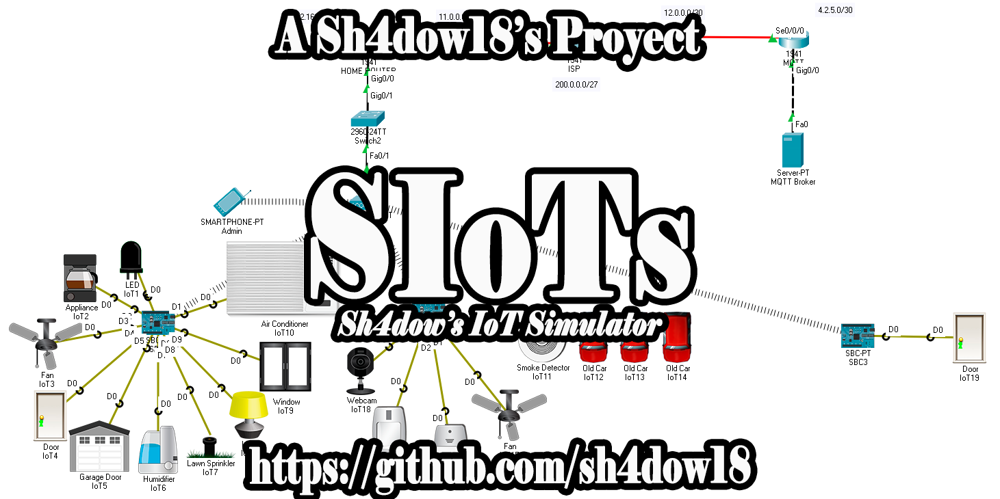

# Overview

This guide teaches how to install Cisco Packet Tracer, as well as how to use IoT
components in a simulated environment where the elements act manually or
automatically so that the user understands how the world of the Internet of
Things works.

I will assume you have basic networking skills and will not explain things like
"IP", netmask or "DHCP".

# Version

Version: **1.0**

# What is Cisco Packet Tracer?

Packet Tracer is a powerful network simulation tool designed by Cisco. This helps
you practice creating simple and complex networks on a variety of devices to
improve on all network components not just routers and switches. With this tool,
you can create interconnected solutions for smart cities, homes and businesses.

Packet Tracer functions as a learning environment for Cisco instructional courses,
distance learning, career training, job planning, or just for fun.

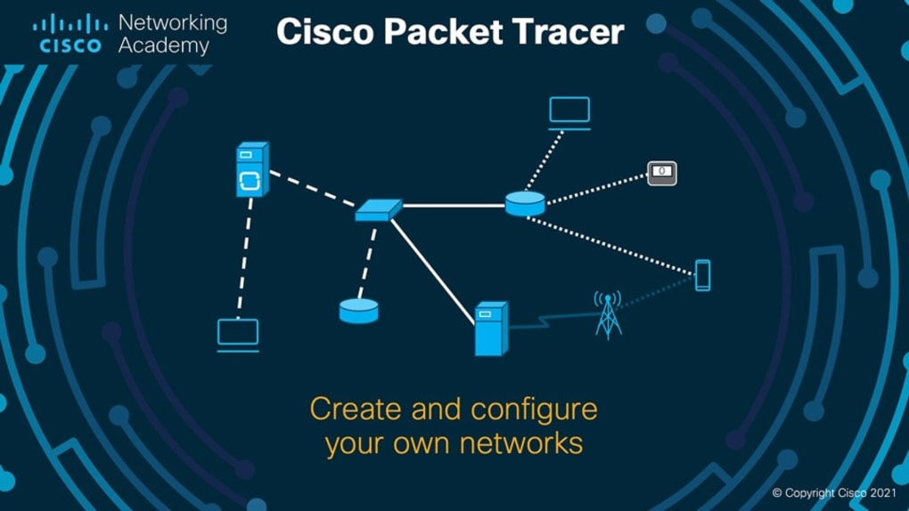

If you want to know more about this, 
**[click here](https://www.netacad.com/courses/packet-tracer)**
 for more information

# Packet Tracer Version

Version: 8.0.0

# Packet Tracer Requirements

	- CPU: Intel Pentium 4, 2,53 GHz or equivalent

	- RAM: 2 GB

	- Storage: 1.4 GB of free disk space

	- Recommended screen resolution: 1024 x 768

# Packet Tracer Installation

To install Cisco Packet Tracer, what you must do is go to the official Cisco website
which is 
**[Netacad](https://www.netacad.com/)**
. Then, you have to create a free Cisco account to get the full functions of the
program, this has to be done in the part that says "Login" or "Sign In". Then, having
created the account, you have to enter "Resources" and then "Download Packet Tracer".
Next, you have to download the latest version for 64 bits, that is, the "x64". This
works on Windows and Linux.

To install it, you must run the program and follow the steps in it.

# What is IoT?

"IoT" or "Internet of Things" is one of the tools most used today in task automation.
It allows devices to connect and interact with each other, this makes it easy to
perform functions with minimal human participation, such as turning on a light or
activating a camera.


If you want to know more about this topic, you can visit 
**[this site](https://www.zdnet.com/article/what-is-the-internet-of-things-everything-you-need-to-know-about-the-iot-right-now/)**
 for more information

# Using SIoTs

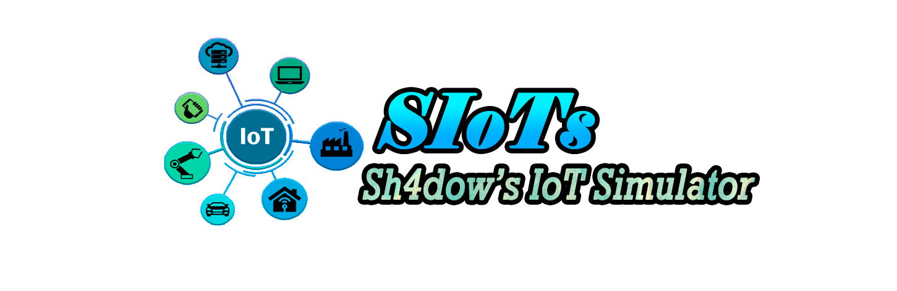

First, you have to download the repository. To download it, you can download the
compressed file (.zip) or clone the repository, with the "git" program installed,
through the CMD in "Windows" or with a terminal in Linux. This is done in the form
(In both cases):

```bash
git clone https://github.com/sh4dow18/SIoTs.git
```

In Linux in some cases the command "sudo" is needed before the previous command.

To use the "Sh4dow's IoT Simulator.pkt" program you have to double click on it, with
Cisco Packet Tracer installed.

This program will display the following:

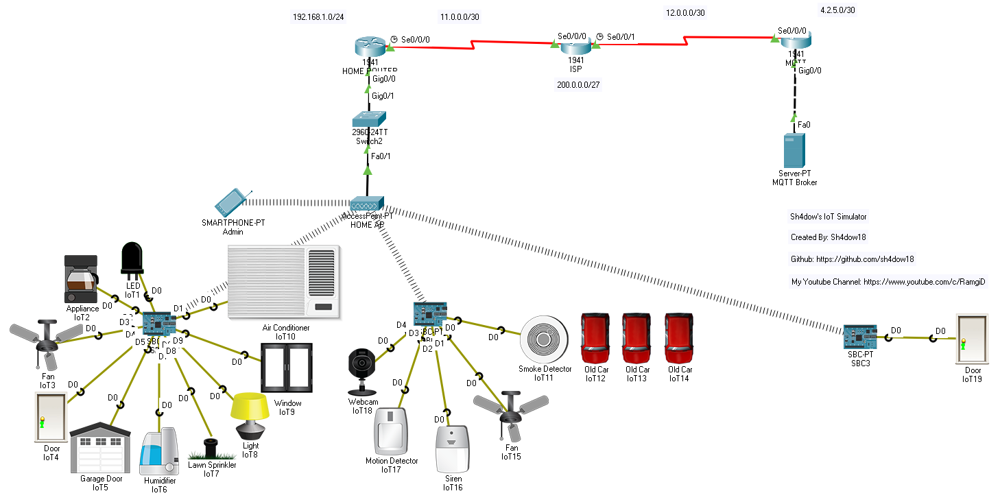

Later, you must wait 2 minutes so that all the components are connected correctly and
that the internal programs work in the best way.

Now, there are 3 ways to test how the IoT works in this version:

	- Manually

	- Automatically on the Same Motherboard

	- Automatically on Different Motherboards

## Manual Way

With the manual option, messages will be sent from a device to control IoT components.
For this, you have to use the cell phone that is connected to the access point.

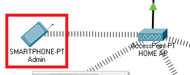

In the smartphone, there is the option "Desktop" (Red Arrow) that has all the applications
that are installed. You have to access to the "MQTT Client" app.

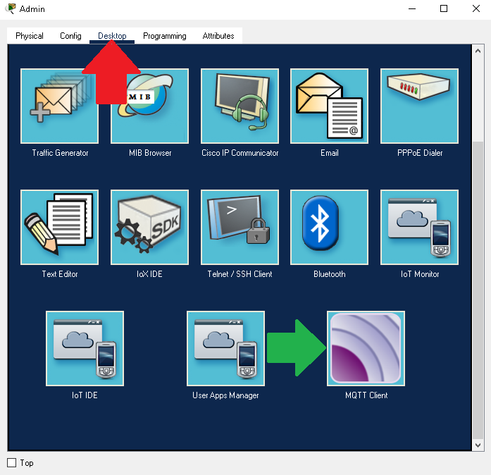

Afterwards, the smartphone automatically connects to the server hosted on another network
as the administrator user (Red Square). Then, you go to the "Publish" section to enter your
message. The message is divided into 2 parts: The topic and the sub-message (payload). The
topic goes in the first box with a "/" in front of it always and the payload in the second
box (Green Square). Then, you have to press the "Publish" button to send the message to
the server (Blue Arrow).

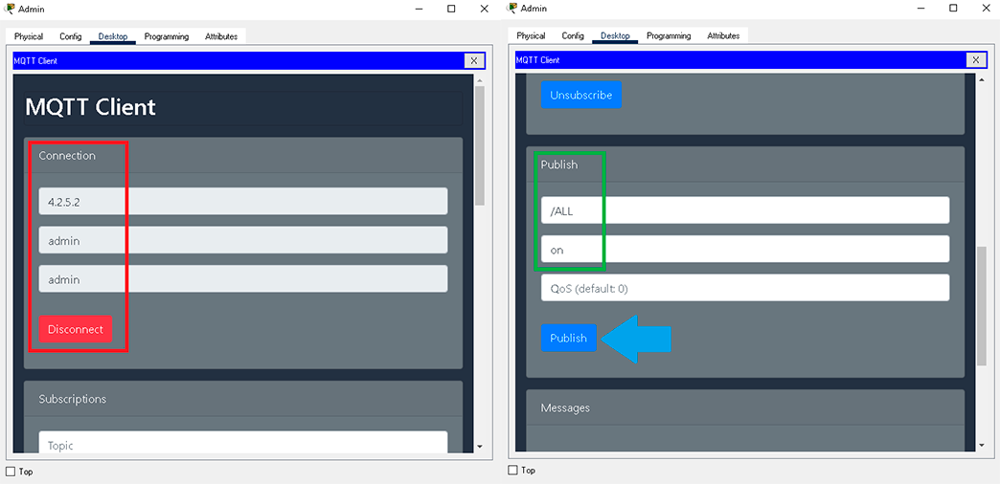

Finally, you can see that by the message all the components connected to the motherboard
turn on or open depending on the component. This happens because of that specific message.


### Messages you can send

| Topic   | Payload | Action                              |
|---------|---------|-------------------------------------|
| /LED    | on      | LED lights up                       |
| /LED    | off     | LED turns off                       |
| /COFFEE | on      | Make coffee                         |
| /COFFEE | off     | Stop making coffee                  |
| /FAN    | on      | The fan turns on                    |
| /FAN    | off     | The fan turns off                   |
| /DOOR   | open    | The door opens                      |
| /DOOR   | close   | The door closes                     |
| /GARAGE | open    | The garage door opens               |
| /GARAGE | close   | The garage door closes              |
| /WATER  | on      | The humidifier turns on             |
| /WATER  | off     | The humidifier turns off            |
| /LAWN   | on      | Lawn Sprinkler Splashes Water       |
| /LAWN   | off     | Lawn Sprinkler stops spraying water |
| /LAMP   | on      | The lamp turns on                   |
| /LAMP   | off     | The lamp turns off                  |
| /WINDOW | open    | The window opens                    |
| /WINDOW | close   | The window closes                   |
| /AIR    | on      | The air conditioner turns on        |
| /AIR    | off     | The air conditioner turns off       |
| /ALL    | on      | All devices turn on or open         |
| /ALL    | off     | All devices turn off or close       |

## Automatic Way on the Same Motherboard

Now to use the automatic way on the same motherboard, you have to activate the car smoke,
this is done by pressing the "ALT" key at the same time as the left click on the car. You
must do it in the 3 cars. When a high amount of smoke is generated, the smoke detector will
alert the motherboard and the motherboard will tell the fan and siren to turn on. In a real
case, the fan would try to disperse the smoke by sending it out of the room and the siren
would alert about the smoke.

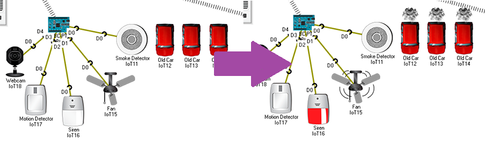

If you turn off the cars, the fan will stop and the alarm will stop sounding.

## Automatic Way on Different Motherboards

Finally, in this way, you will use the motion detector and the camera of the SBC 2, in
addition to that, you will also use the door of the SBC 3.

In Packet Tracer, the mouse is used to detect motion. For this, press "ALT" above the motion
detector and then move the mouse. Automatically, the sensor will turn on indicating movement.

When motion is detected, the instruction to turn on the camera will be sent and the door
connected to the other motherboard will open.

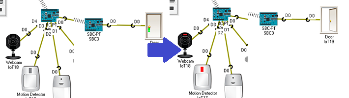

If you stop moving the mouse for 5-10 seconds, the sensor will turn off next to the camera
and thus the door will close.

# Do you want to know more? Read THIS :D

Here is some useful information if you want to learn more about how this topic works.

## How does the "IoT" work?

The "IoT" can work in many ways, but the way it was used in the simulator was by the "MQTT"
protocol. This protocol is one created exclusively for the world of the internet of things.

The "MQTT" protocol was used with a program that comes hidden in Packet Tracer and is not very
common to use. The "MQTT Client" program was used for client devices and "MQTT Broker" for the
server. These are found in the programming section for cell phones, computers, servers, boards,
etc. 

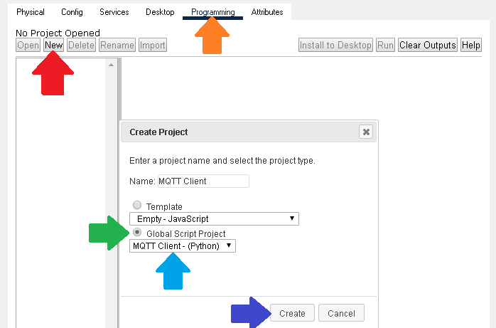

## Why is a program used on a server?

Because this protocol uses a server called "Broker" that works as an intermediary device. This
is in charge of forwarding the messages that reach the clients who are listening.

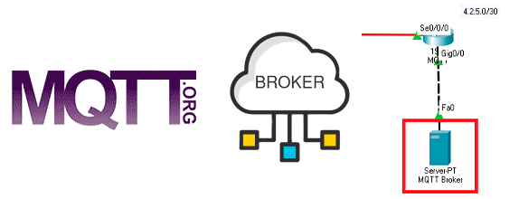

## What does it mean to be listening? 

In the "MQTT" protocol there are 2 functions, subscribe and publish messages. Subscribing is
the way to tell the program to "listen" for messages on a specific topic in the "Broker" and
publishing is to send messages to the server so that another device can "listen" to those
messages.

One device must always be subscribed to a topic and another device must be posting messages
with that topic.


## What programming language was used? 

In Packet Tracer only 2 programming languages can be used to do this, which are "Python" and
"JavaScript". However, the best thing was to use "Python", because the "MQTT Client" and
"MQTT Broker" programs were written in this language and the best thing is that all devices
speak the same language.


## What cable is used to make the connection?

The cable used for "IoT" devices in Packet Tracer is called: IoT Custom Cable

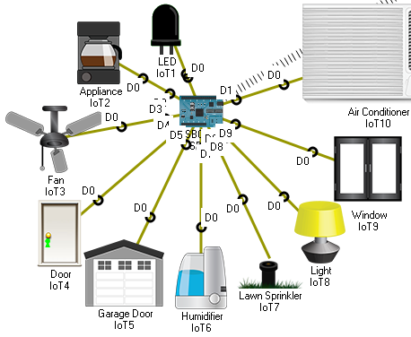

## Can I use WIFI instead of cables?

Yes you can, however, cables connected to an arduino are used so that the use of the bandwidth
was lower and it is less possible to saturate the network. In addition, if you want to use WIFI
on all devices, the communication has to be done in another way outside of those mentioned above.


## Did you have to change code to create the simulator?

Yes, code had to be changed both on the server, to create users who can access the server, and
on the boards to automatically connect to the server. This is the reason why you should wait 2
minutes when opening the simulator, because as this works with packages, they can take time to
communicate.

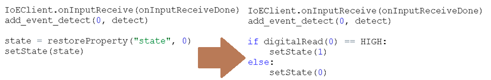

## What code should be changed?

The altered code is found as "Python" code (.py) in the "code" folder within the "files" folder. 

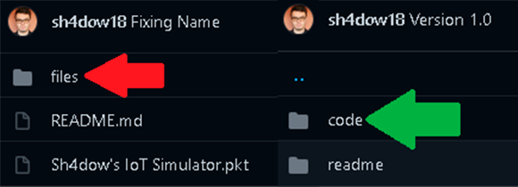

The "LED", air conditioner and the old cars was not altered in their code.


**ONLY THE CHANGES** are made by me, the rest of the code is part of the templates that Packet Tracer has.


Here ends the documentation for now. Eat vegetables and have a Nice Day :D